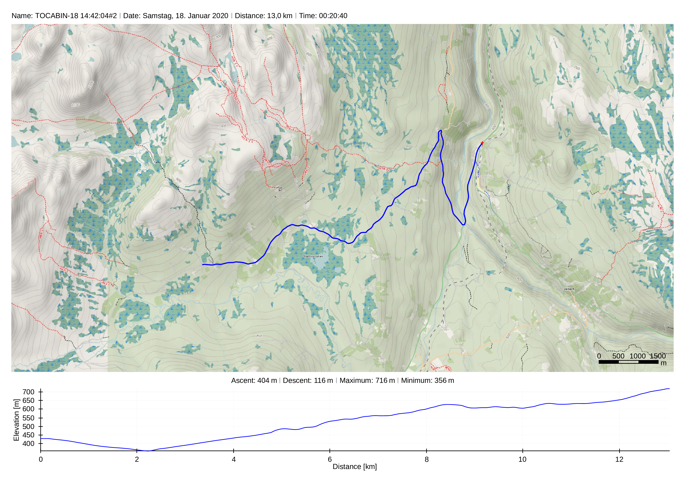
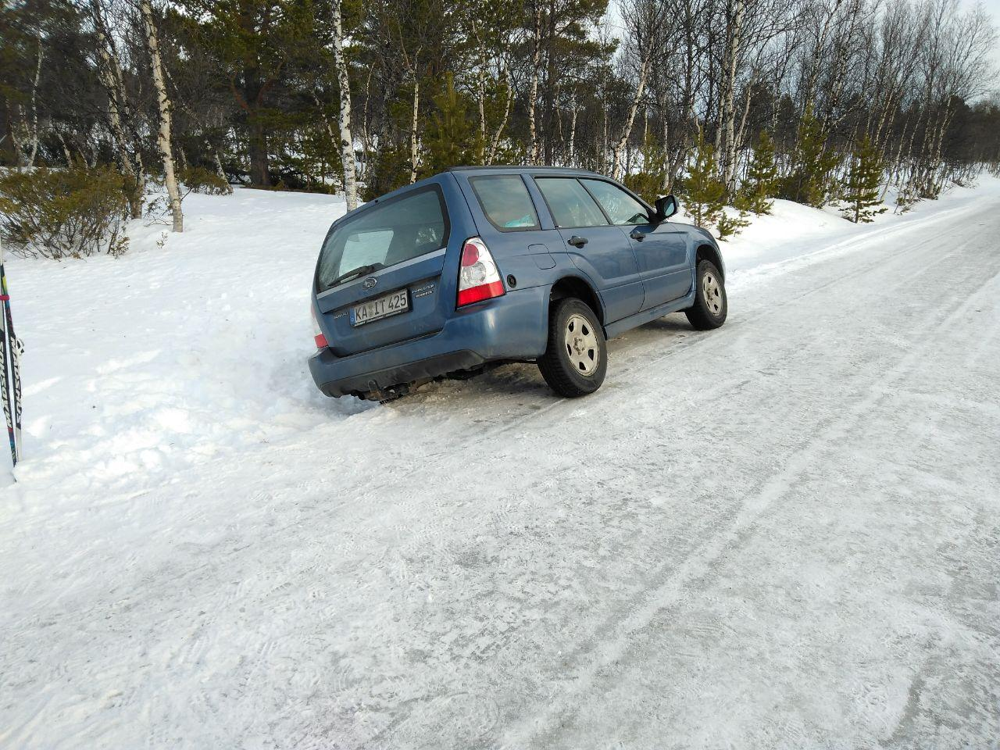
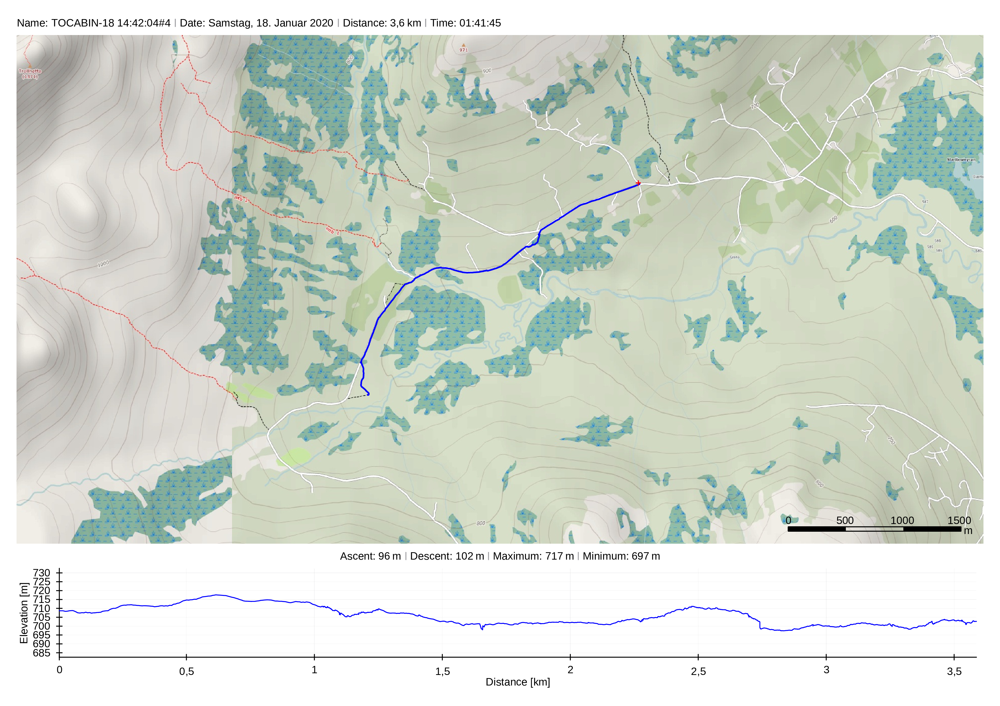
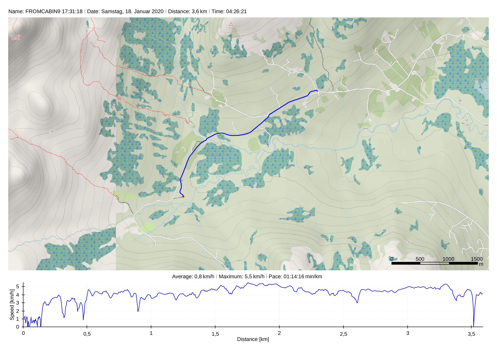

## Cabin Trip To Vekvessætra (2020/01/18 to 2020/01/19)

### Journey To The Cabin

We took three cars (Two rental Ford S-Max and one Subaru Forester) from Trondheim to the parking lot near the cabin. Most of the trip was on the E6, which means road conditions were as good as expected.

 After taking the E6 at exit `13 (Skjephaug)` the roads were mostly gravel or tarmac covered with snow. 

Unfortunately the deep snow hid some abrupt ledges on the side on one of the gravel paths. One move slightly of the track rendered my car incapable to move forward or backward. With deep snow under the left side and the bottom of the car almost sitting on top of the ledge, the hard decision to call a towing truck was made. Luckily one of the street residents was at home and was happy to help us out calling the towing company. After two hours and a fee of NOK3500, my car was free again and undamaged.

From there on the trip on skies went rather uneventful.

### At The Cabin

### Journey Back From The Cabin

The way back from the cabin to our cars was really uneventful. I switched from cross country skies to snow shoes. In mildly deep snow and perfect weather it was really easy covering the distance of around 3.5 km. As you can see in the speed vs. distance plot below, my average speed was about 4 km/h with the snow shoes. The other guys on the skies were a bit faster (6...8 km/h, not shown).

